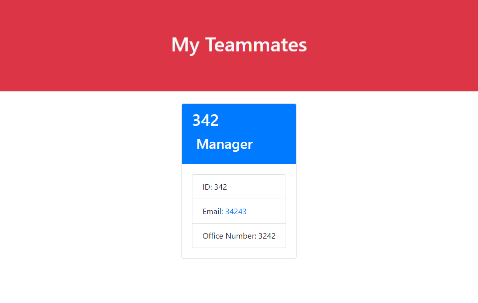

# Team Generator

## Description

This is a teammate generator, which allows you to add your teammates to a list with their prospective emails, ID's, GitHub Usernames, etc. This repository will ask questions based off of the class of your teammate. Attached below will be a photo of what the repository will look like:

The next photo will show you what the generator will look like once it has developed. 

## Usage

In order to use this app, you will need Visual Studio Code and Node.js. You will also need to install inquirer version 8.2.4. 

##  Questions

If you have any questions about the repository, please contact/email benny.le890@gmail.com  
My GitHub profile is found at [GitHub Profile](https//GitHub.com/bennyle890)